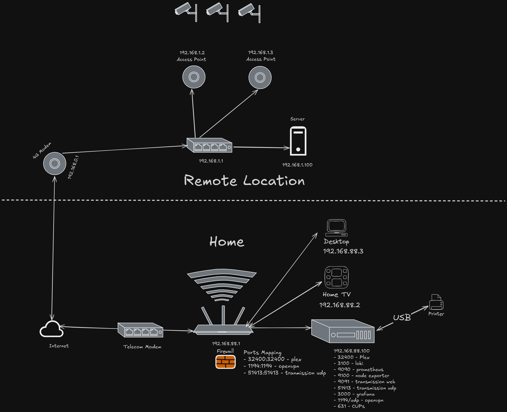

# Homelab

This is the repository for my homelabs. Everything is dockerized via docker compose. 

Main purpose is to learn new things and have a place to experiment. I also host some services for home usage.

## Must read/watch

- [Docker networking is CRAZY!! - NetworkChuck](https://www.youtube.com/watch?v=bKFMS5C4CG0)
